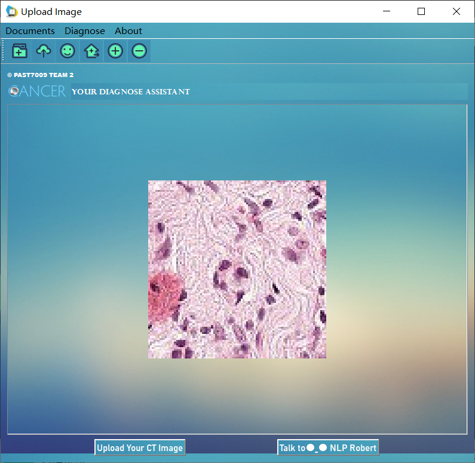

# Lymph-node-sections-detection-based-on-deep-convolutional-neural-networks
This is the open source code for my paper [_Lymph node sections detection based on deep convolutional neural networks_](https://www.spiedigitallibrary.org/conference-proceedings-of-spie/12079/120792F/Lymph-node-sections-detection-based-on-deep-convolutional-neural-networks/10.1117/12.2622998.short)  
You can download the dataset at [data](https://www.kaggle.com/competitions/histopathologic-cancer-detection/data)  

